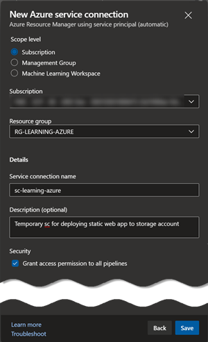

# Introduction

Before we take a closer look at Azure DevOps, let's try understand first what is **DevOps**

According to Microsoft, it is:

> A compound of development (Dev) and operations (Ops), DevOps is the union of people, process, and technology to continually provide value to customers.

> What does DevOps mean for teams? DevOps enables formerly siloed roles—development, IT operations, quality engineering, and security—to coordinate and collaborate to produce better, more reliable products. By adopting a DevOps culture along with DevOps practices and tools, teams gain the ability to better respond to customer needs, increase confidence in the applications they build, and achieve business goals faster.

I like to use this shorter description:

DevOps is a way to ensure **continuos, automated, uninterrupted flow of change**. For software this flow of change will be of course new features and products.

## First look at Azure DevOps

Azure DevOps is a set of collaborative development tools.

It uses *Organization* as a top grouping level. You can use organization to separate business units, departments or distinct physical offices, it is up to you.

Each organization (a default one is created automatically), comes with the following:

> Each organization gets its own free tier of services (up to five users for each service type) as follows. You can use all the services, or choose just what you need to complement your existing workflows.

> - Azure Pipelines: One hosted job with 1,800 minutes per month for CI/CD and one self-hosted job
> - Azure Boards: Work item tracking and Kanban boards
> - Azure Repos: Unlimited private Git repos
> - Azure Artifacts: Package management
> - Unlimited Stakeholders
> - Five Azure DevOps users (Basic)
> - Free tier of Microsoft-hosted CI/CD (one concurrent job, up to 30 hours per month)
2 GiB of Azure Artifacts storage
> - One self-hosted CI/CD concurrent job

Each organization can have one or more *projects*. Organizations are only for grouping and billing purposes, a project is where all interaction with Azure DevOps happens from the user point of view.

Once deployed Azure DevOps Project can contain the following components.


For in-depth review of all services, please refer to official [Azure DevOps Documentation](https://docs.microsoft.com/en-us/azure/devops/user-guide/services?view=azure-devops).

## Sign Up for Azure DevOps

There are two ways to sing up for Azure DevOps. Today we are going to use GitHub integration. Please follow steps [outlined here](https://docs.microsoft.com/en-us/azure/devops/user-guide/sign-up-invite-teammates?toc=%2Fazure%2Fdevops%2Fget-started%2Ftoc.json&bc=%2Fazure%2Fdevops%2Fget-started%2Fbreadcrumb%2Ftoc.json&view=azure-devops#sign-up-with-a-github-account) to setup the Azure DevOps service.

## CI/CD

Out of all the Azure DevOps Services, I would like to focus a bit more on CI/CD process. CI/CD stands for *Continuos Integration/Continuos Deployment/Delivery*. From a very high level perspective, CI/CD looks like this:


Let's take a closer look at what is happening on the diagram and map it to Azure DevOps components.

Parts that are not depicted on the diagram are how the work gets assigned to a developer, here is one common scenario from a SCRUM Process.

In Azure DevOps work comes from [User Stories](https://docs.microsoft.com/en-us/azure/devops/boards/work-items/agile-glossary?view=azure-devops#user-story) refined from PBIs  which stands for [Product Backlog Item](https://docs.microsoft.com/en-us/azure/devops/boards/work-items/agile-glossary?view=azure-devops#product-backlog-item), so let's assume that this is also the case here.

Once a developer starts working on a user story, they will usually create a separate branch, often called [Feature Branch](https://docs.microsoft.com/en-us/azure/devops/repos/git/git-branching-guidance?view=azure-devops#use-feature-branches-for-your-work) and connect it with the User Story.

From this point, the diagram provides a high level overview of a generic CI/CD pipeline.

This is of course a very simplistic pipeline, in real-life scenarios, pipelines are usually much more elaborate. Here is an example of a more mature pipeline:


## Pipelines as Code

Traditionally pipelines in Azure DevOps and its predecessor Team Foundation Service (TFS) were created and managed via GUI. One of the main reasons, why this was a "click-based" process was the fact that Dev and Ops teams were separate silos.

The beginning of [DevOps](https://devopedia.org/devops) movement and [Shift Left](https://devopedia.org/shift-left) philosophy called for inventing new ways of describing build, deployment and infrastructure requirements. Developers should be fully empowered to design and execute pipelines. Based on those requirements [Pipelines as Code](https://www.jenkins.io/doc/book/pipeline-as-code/) were introduced.

## Demo

For the demo purposes we are going to deploy a sample static web page to an Azure Storage Account with Static Website Hosting option enabled.

### Create storage account

Here are the steps If you would like to follow along with the demo:

Login to the Azure portal and select Cloud Shell. Follow [this tutorial](https://docs.microsoft.com/en-us/azure/cloud-shell/overview) to activate cloud shell if you are login for the first time on a fresh account.
Once you are in the cloud shell, make sure to select bash environment and follow the steps below.

```terraform
# Clone the exercise repository
git clone https://github.com/ilearnazuretoday/azure-devops.git

# Switch to right directory
cd azure-devops/terraform

# Initialize terraform with Azure Provider
terraform init

# Validate terraform scripts
terraform plan

# Create infrastructure, confirm with "yes"
terraform apply
```

The output should loo similar to this:


### Create service connection to allow deployment

In order to be able to deploy form our Azure DevOps service to our Azure Subscription, we need to create a service connection to enable it in Project Settings.

This action will create a [*service principal*](https://docs.microsoft.com/en-us/azure/active-directory/develop/app-objects-and-service-principals) account on our behalf to establish the connectivity.

<p float=left>
 
 
 
</p>

> Good practice is to narrow permissions scope!

Note down your service connection name, it will be needed for the pipeline setup.

## Deploy sample static web page

We will deploy a sample app directly from GitHub, but for demo purposes we are going to clone the repository into our Azure DevOps first.

It is very easy to do it in Azure DevOps. Click on repository and use [this link](https://github.com/Piotr1215/pwa-sample.git) to import.


Once the repository has been imported into Azure DevOps, we can setup CI/CD pipeline. The CI/CD pipeline YAML file is already in the repository, but please remember to adjust change

- azureSubscription: *serviceConnectionName from previous step*
- storage: *name of storage account to deploy to from terraform output*

Here are the steps to setup initial build:


Let's look at the pipeline file and see what it contains.

```yaml
trigger:
  branches:
    include:
      - master

  paths:
    exclude:
    # Exclude README.md from triggering content deployments
    - README.md

pool:
  vmImage: "windows-latest"

steps:
- task: DotNetCoreCLI@2
  displayName: 'Build Blazor Project'
  inputs:
    command: build
    projects: '**/*.csproj'

- task: DotNetCoreCLI@2
  displayName: 'Publish'
  inputs:
    command: publish
    arguments: '--configuration Release --output $(Build.ArtifactStagingDirectory)'
    zipAfterPublish: false

- task: PublishBuildArtifacts@1
  displayName: "Upload Artifacts"
  inputs:
    pathtoPublish: '$(Build.ArtifactStagingDirectory)'
    artifactName: 'drop'

- task: AzureFileCopy@3
  displayName: "Copy the bundle to pwa Storage Account"
  inputs:
      SourcePath: "$(Build.ArtifactStagingDirectory)/s/wwwroot"
      azureSubscription: "your-service-connection"
      Destination: "AzureBlob"
      storage: "yourblobstorage"
      ContainerName: "$web"
```

The pipeline file describes steps that need to be performed in sequence to build and deploy our software:

- choose trigger (can be branch, tag, etc)
- make sure to exclude files which you don't want to trigger the pipeline
- choose VM image for build agent
- perform build and deployment steps (specific to what you are deploying)
- check in the yaml file into the repository called `azure-pipelines.yaml`
- trigger a change in your code that satisfies trigger criteria and push changes to remote
- build should trigger automatically
- under the Pipelines -> Pipelines menu, you can observe pipeline logs live


> If you are interested in learning more about PWA web technology, check out [5 Options to deploy static web sites](https://itnext.io/5-static-websites-deployment-options-d0aac1570331)

You might be wondering where do the tasks come from? Like AzureFileCopy or DotNetCoreCLI etc? Those tasks are mostly TypeScript programs or PowerShell scripts and you can see their [source code on GitHub](https://github.com/microsoft/azure-pipelines-tasks/tree/master/Tasks)!

Tasks are generic and reusable and you could write your own as well.

If everything went well, navigate to the url outputted by terraform and you should see a static page deployed! experiment with the CI/CD process.

- Try to change any file (other than README.md), did the pipeline trigger?
- What will happen if there is an error and dotnet cannot build the artifacts?

### Destroy the Infrastructure

This step is **IMPORTANT** if you have followed along with the demo. To avoid unnecessary charges, let’s remove the resources, it is very easy to do this with terraform.

```terraform
# Destroy all resources, confirm with yes
terraform destroy
```

## Conclusion

We have covered a lot of ground and some of the concepts might be new of confusing especially if you are new to Azure. Please don't be discouraged, instead try to review everything step by step and deepen your knowledge in the areas that you are least familiar with.

You can check out [the rest of my blogs](https://medium.com/@piotrzan) to learn more.
